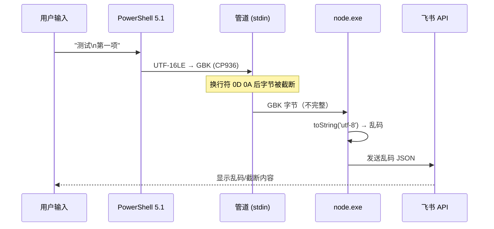

PowerShell 5.1 stdin 编码问题 · 处理方案

## 问题描述

在 Windows 上通过 PowerShell 5.1 使用 `botmux send` 发送多行中文消息时，飞书卡片上只能看到第一行，换行后的内容全部丢失。通过 `--content-file` 传入 UTF-8 文件则正常显示。

## 问题复现

### 有问题的操作

```powershell
# 直接传入多行中文内容（截断！）
botmux send --mention-back "测试

第一项 配置机器人
第二项 多话题协作
第三项 创建飞书群"
```

### 正常操作

```powershell
# 先用 UTF-8 文件传入（正常）
$msg = Join-Path $env:TEMP "test.md"
Set-Content -LiteralPath $msg -Encoding utf8 -Value @'
测试

第一项 配置机器人
第二项 多话题协作
第三项 创建飞书群
'@
botmux send --mention-back --content-file $msg
```

## 问题根源

PowerShell 5.1 在通过管道向原生可执行文件（node.exe）传递数据时，会将 UTF-16LE 内部字符串转为系统活动代码页（中文 Windows = CP936/GBK）。botmux send 的 readStdin() 以 UTF-8 解码这些 GBK 字节，导致乱码。换行符（0x0D 0x0A）之后的 GBK 字节被截断，表现为"只能看到第一行"。

现有检测 rejectLikelyWindowsStdinMojibake 只捕获中文变 ? 的情况，漏掉了截断场景。

## 编码转换链路



## 与 --content-file 的差异

| 传参方式 | 编码路径 | 结果 |
|---------|---------|------|
| 位置参数/stdin | UTF-16LE → GBK → 被 Node 当 UTF-8 读 | 乱码/截断 |
| --content-file | `readFileSync(path, 'utf-8')` 直接读文件 | 正常（文件已 UTF-8 保存） |

## 方案对比

### 方案 A：源码自动编码探测（推荐）
在 readStdin() 中对 Windows 平台自动检测并转换编码：

Node.js v24.12.0 内置 ICU 支持 new TextDecoder('gbk')，无需额外依赖。收集原始字节后，先用 GBK 解码，检查是否包含 CJK 字符——如果是则使用 GBK 结果，否则回退 UTF-8。

优点：用户无感知、零依赖、适配所有 Windows shell（cmd/PowerShell 5.1/PS7）
缺点：需要改源码并重新 build

### 方案 B：安装 PowerShell 7+ 替代 5.1
PowerShell 7+（pwsh.exe）默认以 UTF-8 编码管道数据，不会做代码页转换。

优点：不仅修本问题，还改善所有中文 PowerShell 体验
缺点：不是每个用户都能升级，团队协作难以统一

### 方案 C：启用系统 UTF-8 支持
Windows 设置 → 时间和语言 → 语言和区域 → 管理语言设置 → 更改系统区域设置 → 勾选"使用 Unicode UTF-8 提供全球语言支持"（Beta）

优点：一劳永逸
缺点：Beta 功能，可能影响其他旧应用

### 关于"禁用 PowerShell 5.1"

PowerShell 5.1 是 Windows 10/11 的内置组件，不可删除。但可以：
- 把默认终端改为 PowerShell 7+（pwsh.exe）
- VS Code 中设置 terminal.integrated.defaultProfile.windows 为 "PowerShell 7"
- 不影响 botmux send 的工作——它是独立进程，不依赖 shell 注册

## 我的建议

方案 A（源码自动编码探测）最彻底，用户零感知，一次修好所有人。

已在 botmux 源码中实现方案 A（编码自动探测）。
